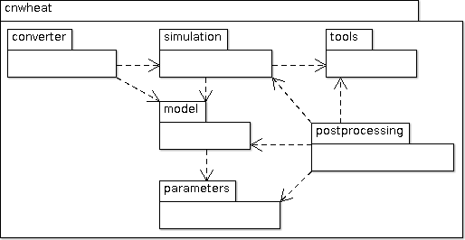
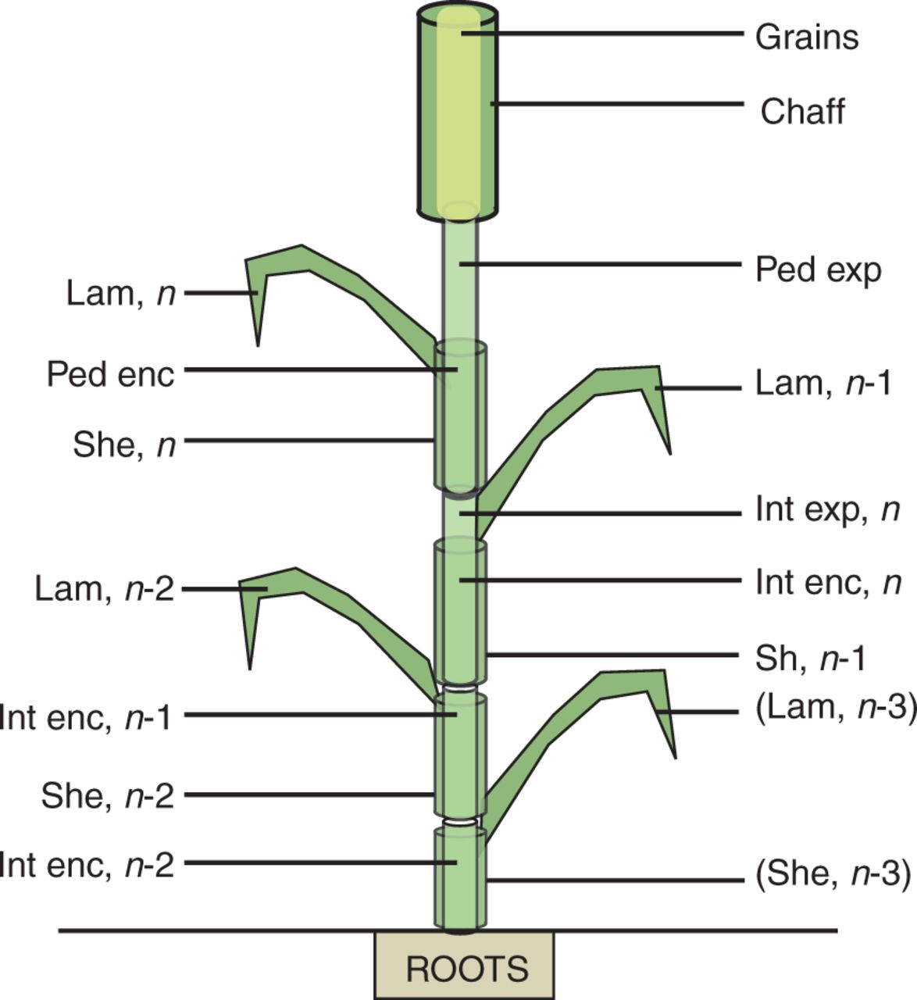
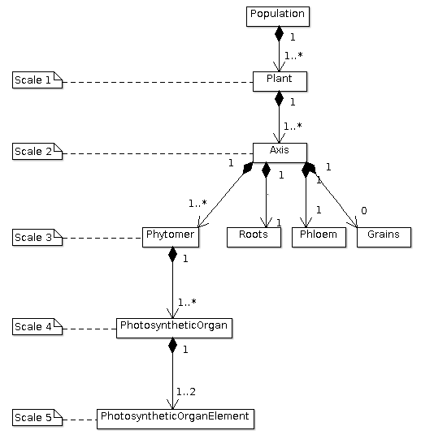
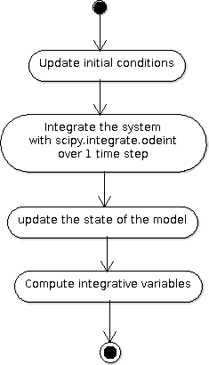
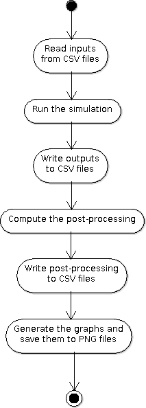

.. _cnwheat_user:

CN-Wheat User Guide
###################

.. contents::

Introduction
************

    CN-Wheat is a model simulating the distribution
    of carbon and nitrogen metabolites into wheat plants described at organ level.
    Shoot organs are represented as a set of laminae, sheaths and internodes, while the root system is represented
    as a single compartment. For each organ, CN-Wheat considers structural material, mobile metabolites (amino acids,
    nitrates and sucrose) and storage metabolites (proteins and fructans). Synthesis, degradation and transport of
    the different metabolites are simulated for each compartment according to the local metabolite concentration
    and the local environment (mainly light, temperature, CO2, soil N). CN-Wheat represents these flows as a set
    of differential equations which are solved at each time step (hourly) assuming a constant plant architecture.
    CN fluxes related to organ growth are therefore accounted for in a supplementary models (elongwheat, growthwheat).

Implementation and architecture
*******************************

Software design
===============

.. _package_architecture:

Package architecture
--------------------

CN-Wheat is a Python package which consists of several Python modules:

* :mod:`openalea.cnwheat.model`: the state and the equations of the model,
* :mod:`openalea.cnwheat.parameters`: the parameters of the model, 
* :mod:`openalea.cnwheat.simulation`: the simulator (front-end) to run the model, 
* :mod:`openalea.cnwheat.postprocessing`: the post-processing and graph functions, 
* :mod:`openalea.cnwheat.tools`: tools to help for the validation of the outputs, 
* and :mod:`openalea.cnwheat.converter`: functions to convert CN-Wheat inputs/outputs to/from Pandas dataframes.

   CN-Wheat architecture

Parameters, variables and equations
-----------------------------------

CN-Wheat is defined at culm scale, the crop being represented as a population of
individual culms. Culms are considered as a set of botanical modules representing
the root system, each photosynthetic organ and the whole grains.

   Botanical description of the culm structure of wheat as implemented in the model (Barillot et al., 2016)

Computationally, the :class:`population <cnwheat.model.Population>` is described as a composition 
of objects, organized in a multiscale tree-like structure:

* a :class:`population <cnwheat.model.Population>` contains one or several :class:`plant(s) <cnwheat.model.Plant>`, 
    * each :class:`plant <cnwheat.model.Plant>` contains one or several :class:`axis(es) <cnwheat.model.Axis>`, 
        * each :class:`axis <cnwheat.model.Axis>` contains:
            * one :class:`set of roots <cnwheat.model.Roots>`,
            * one :class:`phloem <cnwheat.model.Phloem>`,
            * zero or one :class:`set of grains <cnwheat.model.Grains>`,
            * and one or several :class:`phytomer(s) <cnwheat.model.Phytomer>` ; each :class:`phytomer <cnwheat.model.Phytomer>` contains:
                * one :class:`chaff <cnwheat.model.Chaff>` ; each :class:`chaff <cnwheat.model.Chaff>` contains:
                    * one exposed :class:`chaff element <cnwheat.model.ChaffElement>`,
                    * and/or one enclosed :class:`chaff element <cnwheat.model.ChaffElement>`,
                * and/or one :class:`peduncle <cnwheat.model.Peduncle>` ; each :class:`peduncle <cnwheat.model.Peduncle>` contains:
                    * one exposed :class:`peduncle element <cnwheat.model.PeduncleElement>`,
                    * and/or one enclosed :class:`peduncle element <cnwheat.model.PeduncleElement>`,
                * and/or one :class:`lamina <cnwheat.model.Lamina>` ; each :class:`lamina <cnwheat.model.Lamina>` contains:
                    * one exposed :class:`lamina element <cnwheat.model.LaminaElement>`,
                    * and/or one enclosed :class:`lamina element <cnwheat.model.LaminaElement>`,
                * and/or one :class:`internode <cnwheat.model.Internode>` ; each :class:`internode <cnwheat.model.Internode>` contains:
                    * one exposed :class:`internode element <cnwheat.model.InternodeElement>`,
                    * and/or one enclosed :class:`internode element <cnwheat.model.InternodeElement>`,
                * and/or one :class:`sheath <cnwheat.model.Sheath>` ; each :class:`sheath <cnwheat.model.Sheath>` contains:
                    * one exposed :class:`sheath element <cnwheat.model.SheathElement>`,
                    * and/or one enclosed :class:`sheath element <cnwheat.model.SheathElement>`.

   The multiscale tree-like structure of a population of plants

The nitrate concentration in soil is stored and computed in objects of type :class:`cnwheat.model.Soil`. 

These objects include structural, storage and mobile materials, variations in which are
represented by ordinary differential equations driven by the main metabolic activities.
Each object consists of different metabolites and is connected to a common
pool, the phloem, to allow C–N fluxes.

Thus, each class of :mod:`cnwheat.model` defines:

* constants to represent the parameters of the model, 
* attributes to store the current state of the model as compartment values, 
* and methods to compute fluxes and derivatives in the system of differential equations. 

The parameters of the model are stored in module :mod:`parameters <cnwheat.parameters>`. 
Module :mod:`parameters <cnwheat.parameters>` follows the same tree-like structure as module :mod:`model <cnwheat.model>`. 

Front-end
---------

Module :mod:`simulation <cnwheat.simulation>` is the front-end of CN-Wheat, which allows
to :meth:`initialize <cnwheat.simulation.Simulation.initialize>` and :meth:`run <cnwheat.simulation.Simulation.run>`
a :meth:`simulation <cnwheat.simulation.Simulation>`.

At :meth:`initialization step <cnwheat.simulation.Simulation.initialize>`, we first check the 
consistency of the :attr:`population <cnwheat.simulation.Simulation.population>` 
and :attr:`soils <cnwheat.simulation.Simulation.soils>` given by the user. Then we 
set the initial conditions which will be used by the solver.  

When we :meth:`run <cnwheat.simulation.Simulation.run>` the model over 1 time step, we first 
:meth:`update the initial conditions <cnwheat.simulation.Simulation._update_initial_conditions>`. 
Then we call the function :func:`odeint <scipy.integrate.odeint>` of the library :mod:`SciPy <scipy>` 
to integrate the system of differential equations over 1 :attr:`time step <cnwheat.simulation.Simulation.time_step>`. 
The derivatives needed by :func:`odeint <scipy.integrate.odeint>` are computed by 
method :meth:`_calculate_all_derivatives <cnwheat.simulation.Simulation._calculate_all_derivatives>`. 
If no error occurs and :func:`odeint <scipy.integrate.odeint>` manages to integrate the 
system successfully, then we update the state of the model setting the attributes of :attr:`population` 
and :attr:`soils` to the compartment values returned by :func:`odeint <scipy.integrate.odeint>`, and 
we compute the :meth:`integrative variables of the population <cnwheat.model.Population>`.     

   
   A run of the model

Module :mod:`simulation <cnwheat.simulation>` also implements :class:`exception handling <cnwheat.simulation.SimulationError>`  
:mod:`logging <logging>`, and a :attr:`progress-bar <cnwheat.simulation.Simulation.progressbar>`.  

Postprocessing, graphs and tools
--------------------------------

After running the simulation over 1 or several time steps, the user can apply :mod:`postprocessing <cnwheat.postprocessing>` on 
the outputs of the model. These post-processing are defined in module :mod:`postprocessing <cnwheat.postprocessing>`, and can be computed 
using function :func:`postprocessing.postprocessing <cnwheat.postprocessing.postprocessing>`.

Module :mod:`postprocessing <cnwheat.postprocessing>` also provides a front-end to automate the generation of graphs. 
These graphs are useful for the validation of the model.

Finally, module :mod:`tools <cnwheat.tools>` defines functions to:

* plot multiple variables on the same graph, 
* set up loggers,
* check the outputs of the model quantitatively,
* and display a progress-bar.

Module :mod:`converter <cnwheat.converter>` implements functions to convert
CN-Wheat internal :attr:`population <cnwheat.simulation.Simulation.population>` and 
:attr:`soils <cnwheat.simulation.Simulation.soils>` :func:`to <cnwheat.converter.to_dataframes>` 
and :func:`from <cnwheat.converter.from_dataframes>` :class:`Pandas dataframes <pandas.DataFrame>`.

Here is an activity diagram of this example:

   Dataflow of the example

Constraints on use
==================

Consistency of the inputs
------------------------- 

The input :attr:`population <cnwheat.simulation.Simulation.population>` given by the user 
must the following topological rules: 

* the :class:`population <cnwheat.model.Population>` contains at least one :class:`plant <cnwheat.model.Plant>`, 
* each :class:`plant <cnwheat.model.Plant>` contains at least one :class:`axis <cnwheat.model.Axis>`, 
* each :class:`axis <cnwheat.model.Axis>` must have:
    * one :class:`set of roots <cnwheat.model.Roots>`,
    * one :class:`phloem <cnwheat.model.Phloem>`,
    * zero or one :class:`set of grains <cnwheat.model.Grains>`,
    * at least one :class:`phytomer <cnwheat.model.Phytomer>`,
* each :class:`phytomer <cnwheat.model.Phytomer>` must have at least:
    * one photosynthetic organ, among :class:`chaff <cnwheat.model.Chaff>`, :class:`peduncle <cnwheat.model.Peduncle>`,  
      :class:`lamina <cnwheat.model.Lamina>`, :class:`internode <cnwheat.model.Internode>`, or :class:`sheath <cnwheat.model.Sheath>`,
    * or one :class:`hiddenzone <cnwheat.model.HiddenZone>`,
* each :class:`photosynthetic organ <cnwheat.model.PhotosyntheticOrgan>` must have one enclosed element and/or one exposed element.  
  Elements enclosed and exposed must be of a type derived from class :class:`PhotosyntheticOrganElement <cnwheat.model.PhotosyntheticOrganElement>`, 
  that is one of :class:`chaff element <cnwheat.model.ChaffElement>`, :class:`lamina element <cnwheat.model.LaminaElement>`, 
  :class:`internode element <cnwheat.model.InternodeElement>`, :class:`peduncle element <cnwheat.model.PeduncleElement>` or 
  :class:`sheath element <cnwheat.model.SheathElement>`.  
  An element must belong to an organ of the same type (e.g. a :class:`lamina element <cnwheat.model.LaminaElement>` 
  must belong to a :class:`lamina <cnwheat.model.Lamina>`).

Likewise, the input :attr:`soils <cnwheat.simulation.Simulation.soils>` given by the user must 
supply a :class:`soil <cnwheat.model.Soil>` for each :class:`axis <cnwheat.model.Axis>`.  

These rules prevent from inconsistency in the modeled system. There are checked 
automatically at :meth:`initialization step <cnwheat.simulation.Simulation.initialize>`. 
If the :attr:`population <cnwheat.simulation.Simulation.population>` or the :class:`soils <cnwheat.model.Soil>` 
breaks these rules, then the :class:`simulator <cnwheat.simulation.Simulation>` raises an exception 
with appropriate error message.

Continuity of the model
-----------------------

To integrate the system of ordinary differential equations (ODE), the function :func:`odeint <scipy.integrate.odeint>` 
takes as first parameters a function which computes the derivatives at t0::

    dy/dt = func(y, t0, ...)

where ``y`` is a vector.

This function is also called RHS (Right Hand Side) function.

In CN-Wheat, the RHS function is defined by the method :meth:`_calculate_all_derivatives <cnwheat.simulation.Simulation._calculate_all_derivatives>`. 
   
If the RHS function has a discontinuity, this may lead to integration failure, the raise of an exception, and a premature end of the execution. 
A discontinuity in RHS function could be due to the use of inconsistent parameters or to bug(s) in the equations of the model. 

If you get a warning of type "ODEintWarning: Excess work done on this call (perhaps wrong Dfun type)", 
you can try to increase the value of ``ODEINT_MXSTEP`` defined in the body of the method :meth:`run <cnwheat.simulation.Simulation.run>`. 
But you should first enable and check the logs to see if you can settle the problem ahead of the integration. 
Sometimes, this warning is just due to a local discontinuity which does not affect the whole result of the simulation.   

.. _inputs_and_outputs:

Inputs and outputs
******************

The inputs and the outputs of the model consist in state variables describing
the state of the population at a given step.   

All state variables are defined in the classes of the module :mod:`cnwheat.model`.
At a given step, instances of these classes stored the state parameters and state variables which represent 
the state of the system. Metabolic inputs for each compartment are defined in individual csv files located
in the inputs folder of your project.
  
See module :mod:`cnwheat.model` for a documentation on the inputs and outputs of the model. 

.. _post_processing:

Post-processing
***************

The functions which compute the post-processing are defined in the module :mod:`cnwheat.postprocessing`, 
by botanical object.

See module :mod:`cnwheat.postprocessing` for a documentation on the post-processing which can be applied 
on the outputs of the  of the model.
